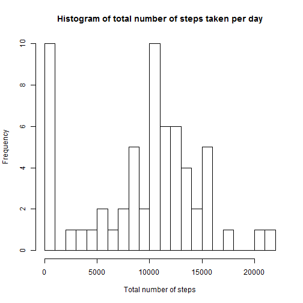
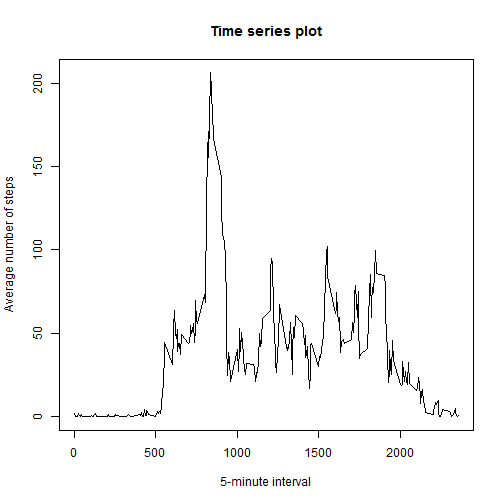
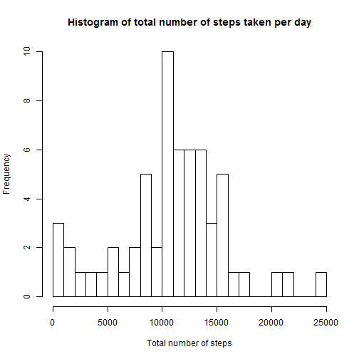
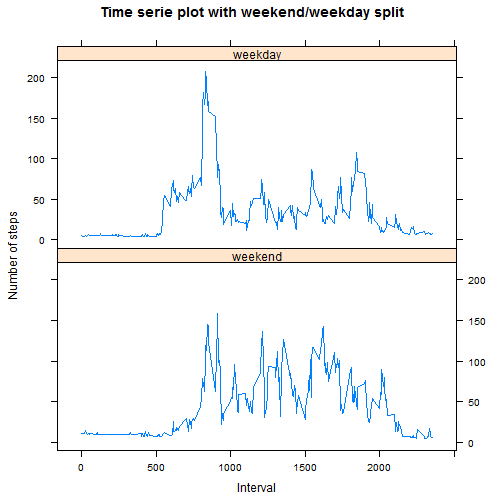

## Loading and preprocessing the data

First of all, needed library are loaded.<br/>
Then, activies data are retrieved from activity.csv file.<br/>
And finally, the date on string format are converted in Date class.<br/>


```r
library(dplyr)
library(lattice)

activities <- read.csv("activity.csv", stringsAsFactors = FALSE)
activities$date <- as.Date(activities$date)
```


## What is mean total number of steps taken per day?

The data previously obtained are grouped by date,<br/>
then, for each day, the sum of step of each interval is calculated.<br/>
The histogram of the total number of steps can now be drawed.


```r
totalNumberStepsPerDay <- activities %>% group_by(date)  %>% summarise(daily = sum(steps, na.rm = TRUE)) 
hist(totalNumberStepsPerDay$daily, breaks=20, main = "Histogram of total number of steps taken per day", xlab = "Total number of steps")
```



With this list of total number of steps for each day, the mean and median can now be easily retrieved.

```r
meanStep <- as.integer(mean(totalNumberStepsPerDay$daily, na.rm = TRUE))
medianStep <- as.integer(median(totalNumberStepsPerDay$daily, na.rm = TRUE))
```
The integer value of mean of total step is 9354.<br/>
The median of total step is 10395.


## What is the average daily activity pattern?

Again, The data previously obtained are used, but now grouped by interval,<br/>
then, for each interval, the mean of step calculated across all days values.<br/>
The time series plot  can now be drawed.


```r
averageStepsPerInterval <- activities %>% group_by(interval)  %>% summarise(averageInterval = mean(steps, na.rm = TRUE)) 
plot(as.numeric(averageStepsPerInterval$interval), averageStepsPerInterval$averageInterval, type="l", main = "Time series plot", xlab = "5-minute interval", ylab = "Average number of steps")
```



```r
maxInterval <- averageStepsPerInterval[which.max(averageStepsPerInterval$averageInterval), "interval"][[1]]
```
The 5-minute interval, on average across all the days in the dataset, containing the maximum number of step is 835.<br/>

## Imputing missing values

First of all, calculate the sum of the NA values.

```r
naNumber <- sum(is.na(activities))
```
The total number of missing values in the dataset is 2304.<br/>
As the average daily activity has been previously calculated, <br/>each NA value will be replaced by the mean of the corresponding interval.


```r
emptyIndexes <- which(is.na(activities$steps))
completeActivities <- activities
completeActivities[emptyIndexes,]$steps <- merge(completeActivities[emptyIndexes,],averageStepsPerInterval)$averageInterval
```

Now, we have completed the dataset, we will build again the histogram :


```r
totalNumberStepsPerDay <- completeActivities %>% group_by(date)  %>% summarise(daily = sum(steps, na.rm = TRUE)) 
hist(totalNumberStepsPerDay$daily, breaks=20, main = "Histogram of total number of steps taken per day", xlab = "Total number of steps")
```



With this list of total number of steps for each day, the mean and median can be retrieved again.

```r
meanStep <- as.integer(mean(totalNumberStepsPerDay$daily, na.rm = TRUE))
medianStep <- as.integer(median(totalNumberStepsPerDay$daily, na.rm = TRUE))
```
The integer value of mean of total step is 10766.<br/>
The median of total step is 11015.

So, with complete data, the mean and median of the total daily number of steps <br/>
 is higher than with original data with NA value.


## Are there differences in activity patterns between weekdays and weekends?

Firstly, we create a function that give a new factor  with two levels - "weekday" and "weekend" indicating whether a given date is a weekday or weekend day. <br/>
Secondly, we apply it at complete data and creating a new column for it.


```r
getWeekPeriod <- function(d) {
    if(weekdays(d) %in% c("Saturday", "Sunday")) {
        return("weekend")
    }
    else {
        return("weekday")
    }
}

completeActivities <- cbind(completeActivities, weekPeriod = mapply(getWeekPeriod, completeActivities$date))
```

Finally, by grouping it by interval and weekPeriod, we split data to draw the plot for weekday and weekend. 


```r
completeActivities <- completeActivities %>% 
                 group_by(interval, weekPeriod)  %>% 
                 summarise(averageInterval = mean(steps, na.rm = TRUE))


xyplot(averageInterval~interval | weekPeriod,
                    type="l", layout=c(1, 2), 
                    data = completeActivities, as.table = TRUE,
                    xlab = "Interval", ylab = "Number of steps", 
                    main = "Time serie plot with weekend/weekday split")
```



So we can observe, that in weekend, the morning peak around 8h35 AM is not as important as it is during week days.
